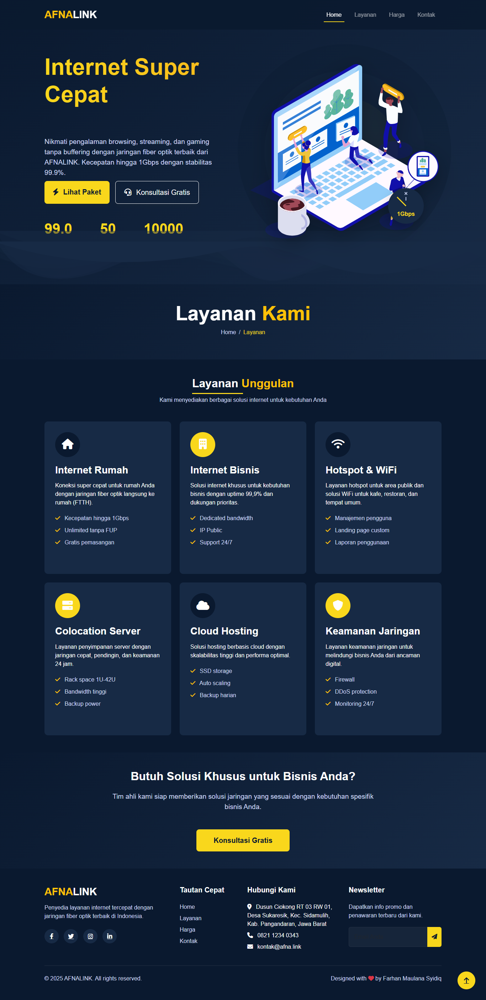

# AFNALINK - Website Perusahaan ISP

## Deskripsi
Website resmi untuk AFNALINK, penyedia layanan Internet Service Provider (ISP) di Indonesia. Website ini menampilkan layanan, paket harga, dan informasi kontak perusahaan.

## Fitur Utama
- **Halaman Responsif**: Tampilan optimal di desktop, tablet, & mobile
- **4 Halaman Utama**:
  - Home/Beranda
  - Layanan
  - Harga/Paket
  - Kontak
- **Animasi Modern**: Efek visual menarik untuk pengalaman pengguna yang lebih baik
- **SEO Friendly**: Optimasi untuk mesin pencari

## Teknologi
- HTML5
- CSS3 (dengan Bootstrap 5)
- JavaScript
- [Font Awesome](https://fontawesome.com/) untuk ikon

## Cara Menggunakan
1. Clone repository ini
2. Buka file `index.html` di browser
3. Navigasi melalui menu untuk melihat semua halaman

## Lisensi
Proyek ini dilisensikan dibawah [MIT License](LICENSE).

---

**AFNALINK** © 2023 - [kontak@afna.link](mailto:kontak@afna.link)